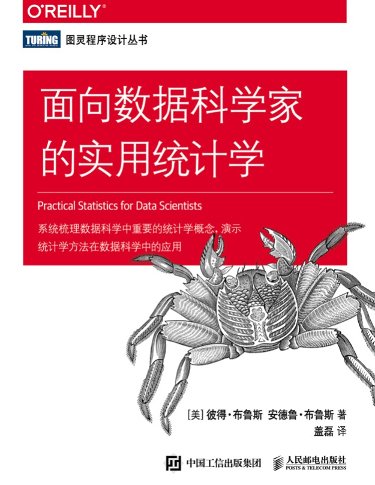

# Practical Statistics For Data Scientists

  

## [封面说明 - Pachygrapsus Crassipes ](pachygrapsus-crassipes.md)  

## [作者简介](author.md)

## [内容](content/)

### 第1章 探索性数据分析
### 第2章 数据和抽样分布
### 第3章 统计实验与显著性检验
### 第4章 回归与预测
### 第5章 分类
### 第6章 统计机器学习
### 第7章 无监督学习  

## Python 代码

